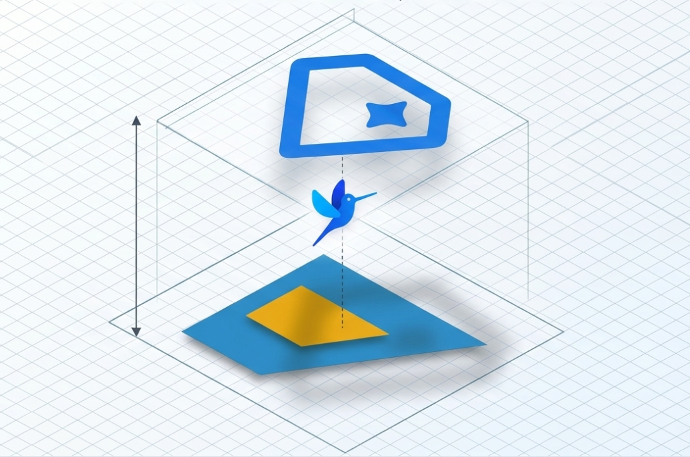

# SAP Joule Integration for SAP GUI — Automation & Screen Intelligence Samples

<p align="center">
  
</p>

[](https://api.reuse.software/info/github.com/SAP-samples/joule-gui-automation-and-integration)

## Description

This repository collects sample [Joule](https://www.sap.com/products/artificial-intelligence/ai-assistant.html) capabilities that demonstrate two complementary integration patterns between Joule and the SAP Business Client / SAP GUI for Windows:

- **Joule → SAP GUI automation:** Joule capabilities that drive an SAP GUI session through frontend actions (`executeScript`, `executeGuidedScript`, `describeUI`, ...) provided by the SAP Business Client.
- **SAP GUI → Joule integration:** Patterns for surfacing context from the running SAP GUI session back into Joule (transient context, UI tree inspection, content-based agents).

The samples are intended as a starting point for SAP customers and partners building their own Joule capabilities on top of the SAP Business Client. They are **not** production-ready solutions and contain no customer-specific business logic.

## Capabilities

### `execute_guided_script` — Create a Product Step-by-Step

A guided-script sample that creates a product in transaction `SEPM_PD` (a publicly available training/demo transaction shipped with the EPM reference scenario). The script enters a randomly generated product ID, fills the Header Data fields, switches to the Conversion Factors tab and adds a row. Joule asks the user to confirm each server roundtrip before continuing, so users can review and adjust values at every step.

**Trigger utterance:**

> Create product

**Demonstrated patterns:**

- `frontend-action` invocation of `com.sap.uic.unified.frontend.actions.executeGuidedScript`
- `user-confirmation` action to gate long-running GUI scripts

**Files:**

- `capabilities/execute_guided_script/capability.sapdas.yaml`
- `capabilities/execute_guided_script/scenarios/execute_guided_script.yaml`
- `capabilities/execute_guided_script/functions/execute_guided_script.yaml`

### `summarize_current_screen` — Quick Screen Summary

Produces a fast summary of the entire current SAP GUI screen. No user input is required — the capability calls `describeUI` on the whole window (`wnd[0]`) through an agent with a Joule toolkit, and the agent formats the JSON tree into readable markdown showing the screen title, tabs, field values, and buttons.

Tables and tree contents are not expanded in this mode (use `summarize_screen_area` for that).

**Trigger utterance:**

> Summarize the current SAP GUI screen.

**Demonstrated patterns:**

- `agent-request` with a `joule` toolkit that calls a dialog function wrapping a `describeUI` frontend action
- LLM-based formatting of raw UI tree JSON into structured markdown
- Zero-slot capability (no user input needed)

**Files:**

- `capabilities/summarize_current_screen/capability.sapdas.yaml`
- `capabilities/summarize_current_screen/scenarios/summarize_current_screen.yaml`
- `capabilities/summarize_current_screen/functions/summarize_current_screen.yaml`
- `capabilities/summarize_current_screen/functions/describe_ui.yaml`
- `capabilities/summarize_current_screen/agents/screen_summarizer.yaml`

### `summarize_screen_area` — Targeted UI Area Summary

Summarizes a chosen area of the SAP GUI screen by a user-provided root element ID (e.g. `wnd[0]/usr` for the user area, or a specific tab strip container). Unlike the whole-screen summary, this mode expands table rows and tree node hierarchies within the selected subtree.

**Trigger utterance:**

> Summarize a UI area of the current SAP GUI screen by root element ID.

**Demonstrated patterns:**

- Slot-based capability: Joule asks the user for the `root_element_id` before invoking the function
- `agent-request` with a parameterized `joule` toolkit call (passes the root element ID to the `describeUI` frontend action)
- Markdown rendering of expanded tables (up to 20 rows) and hierarchical tree nodes

**Files:**

- `capabilities/summarize_screen_area/capability.sapdas.yaml`
- `capabilities/summarize_screen_area/scenarios/summarize_screen_area.yaml`
- `capabilities/summarize_screen_area/functions/summarize_screen_area.yaml`
- `capabilities/summarize_screen_area/functions/describe_ui_area.yaml`
- `capabilities/summarize_screen_area/agents/screen_area_summarizer.yaml`

---

Further capabilities will be added over time.

## Demos

### Summarize Current Screen

Joule reads the entire SAP GUI screen and delivers a concise, structured summary of all visible fields, tables, and status information.

https://github.com/user-attachments/assets/cfe5ee1f-63ae-4a68-9736-21b7b58e2f7b

### Create Product (EPM Demo)

Joule automates end-to-end product creation in SAP GUI transaction (e.g. SEPM_PD) by filling in all required fields and saving the entry through guided GUI scripting.

https://github.com/user-attachments/assets/65e0ae1e-9517-421b-9fe2-fff26d790760

## 🎯 Business Goal

Eliminate repetitive manual data entry in SAP GUI transactions by letting end users drive them through natural-language chat in SAP Business Client.

- 🗣️ Joule interprets the user's intent
- ⚙️ Your capability translates it into deterministic SAP GUI Scripting steps
- ✅ The existing transaction runs unchanged — no ABAP modification, no parallel UI to maintain

## Requirements

### 🖥️ Client Components

Download and install the following client components.

| ✔️ | Component | Minimum Version |
|----|-----------|-----------------|
| 🖥️ | SAP Business Client | 8.10 or higher |
| 🪟 | SAP GUI for Windows | 8.10 or higher |

⬇️ [Download: SAP GUI / SAP Business Client 8.10 on SAP Support Portal](https://me.sap.com/softwarecenter/template/products/_APP=00200682500000001943&_EVENT=DISPHIER&HEADER=Y&FUNCTIONBAR=N&EVENT=TREE&NE=NAVIGATE&ENR=73554900100200022951&V=INST)

> ℹ️ The link points to Patch Level 0 (PL0). If a higher Patch Level is already available in the Software Center, always pick the latest one.

### 🛠️ Developer Toolchain — Pro-Code Tools for Joule

To develop and deploy your own Joule capability you need the pro-code development tools for Joule. They provide a complete environment for building, validating, and managing assistants and consist of two components:

| ✔️ | Tool | Purpose |
|----|------|---------|
| ⌨️ | Joule Studio CLI | Command-line tool to scaffold, validate, package, and deploy capabilities |
| 📝 | Joule Studio Code Editor | VS Code extension for authoring capability YAML with schema validation and previews |

📘 [Pro-Code Development Tools for Joule — Installation & Setup](https://help.sap.com/docs/joule/joule-development-guide-ba88d1ec6a1b442098863d577c19b0c0/pro-code-development-tools-for-joule?locale=en-US)

### 🔐 Joule Bot Access

To log on to the Joule bot you need an **SAP Identity Authentication Service (IAS)** account that is assigned to your Joule tenant.

- 🆔 The IAS user is typically your **corporate e-mail address**
- 🔑 The initial credentials and tenant URL are provided by your **Joule tenant administrator**

### 🤖 Enable Custom Agent Deployment (Admin Center Consent)

The `summarize_current_screen` and `summarize_screen_area` capabilities — and any capability that uses an `agent-request` to a content-based agent — require **explicit admin consent** before they can be deployed. Custom agents are currently a free promotional feature, so the Joule platform blocks their deployment until a tenant administrator opts in.

Without consent, deployment does **not** fail with a compilation error — the capability is silently skipped with a warning:

```
Skipping deployment for capability: <name> includes a custom agent, which cannot be
deployed without user consent. Please remove the agent or provide consent via Admin
Center and try again.
```

To enable it:

1. Open the **Joule Admin Center** (from the BTP subaccount where Joule is provisioned).
2. Go to the **Joule Editor for Building Agents** tab.
3. **Enable the consent** toggle for custom agent deployment.

The deploying user also needs the correct Joule roles assigned in BTP (see the "Assign Roles" section of the Admin Center documentation). If deployment reports `User is not authorized to deploy sap capabilities`, check the role assignment as well.

📘 [Joule Admin Center](https://help.sap.com/docs/joule/serviceguide/joule-admin-center)

### 🏷️ Capability Namespace — `com.sap.das.demo` vs. `joule.ext`

The sample capabilities in this repository ship with the namespace `com.sap.das.demo`, which is an SAP-owned demo namespace. This is fine for evaluating the samples on a demo/test tenant, but for **your own extensions on a customer tenant you should re-namespace the capabilities to `joule.ext`**:

- **`joule.ext`** is the reserved namespace for **customer extensibility**. A user with the Joule **Extensibility role** can only create and update capabilities under `joule.ext.*` — this is the intended namespace for your own capabilities on a tenant you don't own SAP-namespace deploy rights for.
- **`com.sap.das.demo`** (and other `com.sap.*` namespaces) are SAP-owned. Updating capabilities there requires the broader **Capability Developer + Admin** role and is not the right home for customer-authored content.

To re-namespace, change the `namespace:` field in each `capability.sapdas.yaml`:

```yaml
capability:
  namespace: joule.ext   # was: com.sap.das.demo
```

> ℹ️ A capability is matched for update by `namespace + name + version`, so keep the namespace consistent across re-deployments.

### 📚 Setup & Onboarding Guides

- 📘 [General Onboarding Guide for Joule](https://help.sap.com/docs/joule/integrating-joule-with-sap/onboarding-joule?locale=en-US)
- 📗 [Joule for SAP S/4HANA Cloud Private Edition — Comprehensive Setup Guide](https://community.sap.com/t5/enterprise-resource-planning-blog-posts-by-sap/joule-for-sap-s-4hana-cloud-private-edition-a-comprehensive-setup-guide/ba-p/13786453)
- 🚀 [Activate Joule for SAP S/4HANA Private Cloud Edition (Discovery Center Mission)](https://discovery-center.cloud.sap/protected/index.html#/missiondetail/4729/5013/?tab=overview)

### 🗄️ Backend Requirements

The Joule capability drives an existing SAP GUI transaction on your **on-premise ABAP system** via SAP GUI Scripting. Make sure the backend is reachable from your client, the demo transaction is accessible to your user, and GUI Scripting is switched on — otherwise the frontend action cannot execute against the backend.

| ✔️ | Component | Requirement |
|----|-----------|-------------|
| 🗄️ | **ABAP system** | Reachable from your client; standard SAP GUI logon working |
| 🔓 | **Transaction `SEPM_PD`** | Authorization to launch the transaction (default authorization for all users in standard systems) |
| ⚙️ | **SAP GUI Scripting enabled** | Profile parameter `sapgui/user_scripting = TRUE` (tx `RZ11`) |

### ⚙️ NwbcOptions.xml Configuration

`NwbcOptions.xml` is the central configuration file that tells SAP Business Client to embed Joule into the SAP GUI session and which Joule tenant to connect to. Without these entries, the Joule panel will not appear inside SAP GUI. Adjust the file as described below.

If `C:\ProgramData\SAP\NWBC\NwbcOptions.xml` does not exist, copy the template:

```
C:\ProgramData\SAP\NWBC\NwbcOptions.xml.810template
   →  C:\ProgramData\SAP\NWBC\NwbcOptions.xml
```

Add under `<singleoptions>`:

```xml
<enablejouleinsapgui>true</enablejouleinsapgui>
<joulebotname>your-joule-bot-name</joulebotname>
<joulewebclienturl>https://your-joule-tenant-host/resources/public/webclient/bootstrap.js</joulewebclienturl>
```

Change `TrackingPreventionLevel` to `None` under `<edgesettings>`:

```xml
<trackingpreventionlevel>None</trackingpreventionlevel>
```

## 🏁 Outcome

After completing the setup above and deploying a capability from this repository, you will have:

| ✔️ | Deliverable |
|----|-------------|
| 🤖 | A working Joule capability automating one SAP GUI transaction end-to-end (demo: product creation in `SEPM_PD`) |
| 🌉 | Frontend-action bridge wiring chat → capability → SAP GUI Scripting |
| 🚀 | Capability deployed to your tenant and callable from any Business Client session |
| 🧩 | Mastery of the authoring pattern: capability YAML + scenario routing + GUI Scripting action |

The real win: you can now apply this pattern to the next transaction yourself — turning Joule into a reusable automation layer over your existing SAP GUI for Windows landscape.

## Known Issues

No known issues.

## How to obtain support

[Create an issue](https://github.com/SAP-samples/joule-gui-automation-and-integration/issues) in this repository if you find a bug or have questions about the content.

For additional support, [ask a question in SAP Community](https://answers.sap.com/questions/ask.html).

## Contributing

If you wish to contribute code, offer fixes or improvements, please send a pull request. Due to legal reasons, contributors will be asked to accept a DCO when they create the first pull request to this project. This happens in an automated fashion during the submission process. SAP uses [the standard DCO text of the Linux Foundation](https://developercertificate.org/).

## License

Copyright 2026 SAP SE or an SAP affiliate company and joule-gui-automation-and-integration contributors. Please see our [LICENSE](LICENSE) for copyright and license information. Detailed information including third-party components and their licensing/copyright information is available [via the REUSE tool](https://api.reuse.software/info/github.com/SAP-samples/joule-gui-automation-and-integration).
